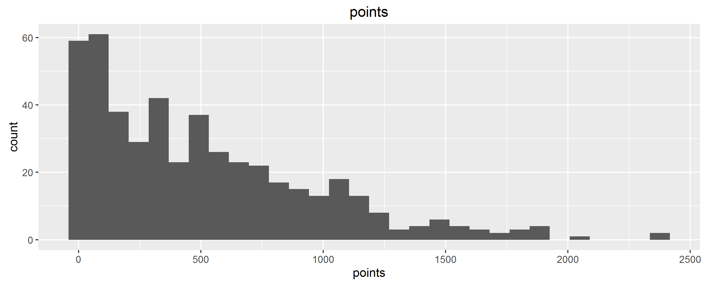
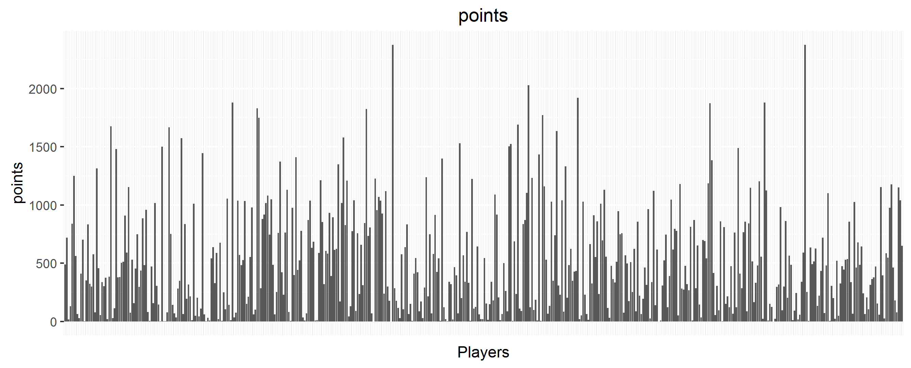
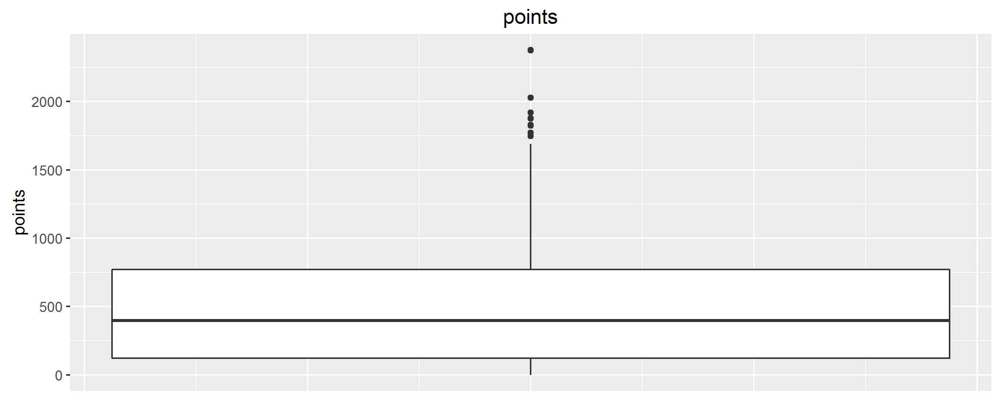

```{r setup, include=FALSE}
knitr::opts_chunk$set(echo = TRUE)
```


# Data

## Basketball Reference

- Team URLS of format :

http://www.basketball-reference.com/teams/CLE/2016.html

- 30 Teams

- Problem : HTML comments around tables

- Solution: readLines()

```{r, eval = F}
basketref <- 'http://www.basketball-reference.com'
url_team <- paste0(basketref, team_urls[i])
html_doc <- readLines(con = url_team)

# Now we can scrape our tables directly from the lines that we read
# (using the functions that we made for this purpose)
scrape_roster(doc = html_doc, team_abbrev = team_names[i])

```


## Cleaning
- Convert and reformat units  

- Deduplicate  

- Identify and mark outliers  

- Merge all dataframes and write to a CSV

<br />

<div class="centered">
Final dataframe includes 37 variables of 476 players.
</div>

# Exploratory Data Analysis

## Summary Statistics

- Iterate through each variable and write to a txt file

- sink()  

Ex:
```
======================================================
steals:

   Min. 1st Qu.  Median    Mean 3rd Qu.    Max. 
   0.00   11.00   29.00   38.89   58.00  169.00 

Range: 169 
 
Standard Deviation: 35.3236 
======================================================
```

## Plots

- 25 variables plotted  
- Histograms, barplots, boxplots 



## Barplots
<div class="centered">

</div>

## Boxplots
<div class="centered">

</div>  

## Salary Statistics per Team
- Aggregated summary statistics by team  

- Developed app using Shiny for interactive data analysis  

- Shiny App: https://randrewnichol.shinyapps.io/team-salaries/

Discoveries:  

- 76ers (min) total payroll slightly above 1/4 that of the Miami Heat (max)  

- Cleveland Cavliers highest average payroll at ~ $6.5 million  

- Miami Heat most deviated payroll  

- Try for yourself!

# Efficiency Analysis via Principal Components Analysis

## Performance of Players
- prcomp()  

- Weighted by five different positions (Point Guard, Center, 
Power Forward, Small Forward, Shooting Guard)  

- Calculated Efficiencies: 
 
Most Efficient:  James Harden (EFF = 13.543)

Least Efficient (>=30 games) :  Pat Connaughton (EFF = .782)  

20 most efficient and least efficient (>=30 games) saved to text file.

## Another Interactive Visualization

Interactive Shiny App plotting player variables and their correlations.  

https://randrewnichol.shinyapps.io/stat-salaries/  

(Can be adjusted to display plots by player position)

Discoveries:  

- Player EFF rating and salary positively correlated. Perhaps
not as strongly as expected (r = .654)?

- Points scored is the most directly correlated individual 
statistic to salary (r = .599), which shows that teams may value offensive
players more highly than defensive.

- Try for yourself!

# Results

## Conclusions

- Very clear correlation between player performance and salary, although 
salaries could certainly be optimized if one were to believe that statistics 
should be the most determinant factor of a player's salary.  


- Most of the "highest valued" players tended to be consistent players with
moderate salaries, and not "big name players".  

- James Harden continuously appearing to be the most efficient and 
most impactful player, although Stephen Curry was awarded season MVP as the 
18th most efficient player in the league. (perhaps his ability to shoot
three-pointers tended to stand out more among voters)  

- Playoff champions Golden State Warriors had the 8th highest payroll
but the largest interquartile range of salaries by a decent margin. 

# Thanks!